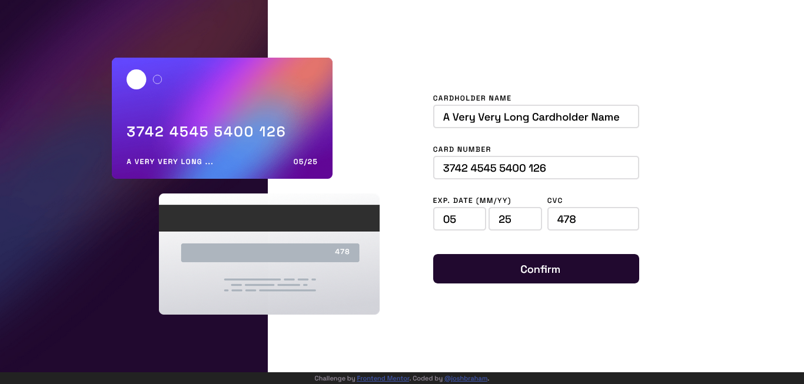

# Frontend Mentor - Interactive card details form solution

This is a solution to the [Interactive card details form challenge on Frontend Mentor](https://www.frontendmentor.io/challenges/interactive-card-details-form-XpS8cKZDWw).

### **[Hosted with Netlify]()** (Live site link)

---

## **The Challenge**

Users should be able to:

- Fill in the form and see the card details update in real-time
- Receive error messages when the form is submitted if:
  - Any input field is empty
  - The card number, expiry date, or CVC fields are in the wrong format
- View the optimal layout depending on their device's screen size
- See hover, active, and focus states for interactive elements on the page

## Screenshot



## My Process

### Built with

- CSS custom properties
- Flexbox
- CSS Grid
- [React](https://reactjs.org/) (JS library) & create-react-app
- [Framer Motion](https://www.framer.com/motion/) (React library)

---

## What I Learned

Custom input handling in react is very useful!

Inputs with `type=number` don't seem to work as they would in plain HTML. So instead, I used a custom hook, `useNumerForm()`, to easily create an on-change event handler that would prevent the user from entering anything that was not a `DIGIT`:

(_find this in_ **src/utils/useNumberForm.js**)

```js
export const DIGITS = ["0", "1", "2", "3", "4", "5", "6", "7", "8", "9"];

export function useNumberForm(...fields) {
  const [values, setValues] = useState(
    fields.reduce((state, field) => {
      return { ...state, [field]: "" };
    }, {})
  );

  const handleNumberChange = ({ target }) => {
    const formattedValue = target.value
      .split("")
      .filter((char) => DIGITS.includes(char))
      .join("");
    setValues((current) => ({ ...current, [target.name]: formattedValue }));
  };

  return { ...values, handleNumberChange };
}
```

---

## Author

- Frontend Mentor - [@joshbraham](https://www.frontendmentor.io/profile/joshbraham)
